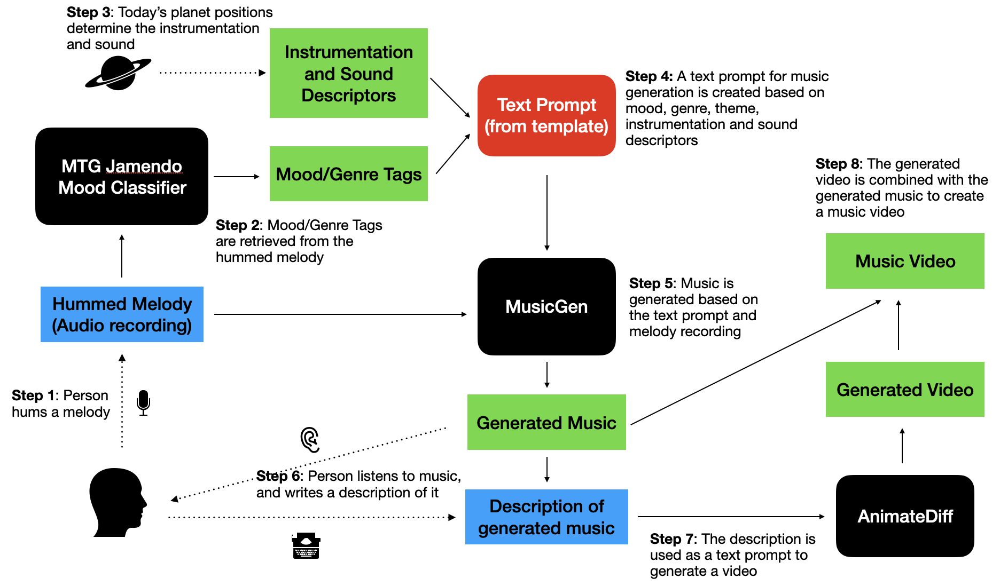

# Hum Me a Melody
A Computational Creativity project - music video generation from melody and user interaction


## Models used

- [MTG Jamendo Mood Classifier](https://essentia.upf.edu/models.html#mtg-jamendo-mood-and-theme): Trained on an in-house dataset, this model by the Music Technology Group (MTG) at the Universitat Pompeu Fabra (UPF) predicts 56 types of moods and genres on audio files.

- [MusicGen](https://github.com/facebookresearch/audiocraft/blob/main/docs/MUSICGEN.md): Trained on 20,000 hours of licensed music, this model by Meta’s FAIR team generates music based on a text prompt, conditioned on an input audio.

- [AnimateDiff](https://huggingface.co/ByteDance/AnimateDiff-Lightning): Trained on [WebVid-10M](https://github.com/m-bain/webvid), a dataset of stock videos, this model by ByteDance generates videos based on a text prompt, using [epiCRealism](https://civitai.com/models/25694) as its text-to-image base model.

## Setup steps
1. Install dependencies with poetry
`poetry install`

2. Download essentia models and save to `tf_graph_files/` folder
```
wget https://essentia.upf.edu/models/music-style-classification/discogs-effnet/discogs-effnet-bs64-1.pb -P tf_graph_files
wget https://essentia.upf.edu/models/classification-heads/mtg_jamendo_moodtheme/mtg_jamendo_moodtheme-discogs-effnet-1.pb -P tf_graph_files
```

3. Run gradio app
`cd src && poetry run app.py`

## Notebooks
`hum_me_a_melody_gradio_final.ipynb` - Google Colab compatible notebook